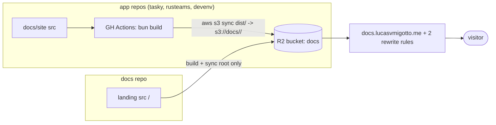

# Architecture — central docs hub

Status: Draft

## Summary

One Cloudflare R2 bucket serves `docs.lucasvmigotto.me`, with one prefix per
app (`/tasky/`, `/rusteams/`, `/devenv/`) plus a thin landing at `/`.
Each app repo keeps its own `docs/site/` source and pushes its built `dist/`
to its own prefix on `main`. Two generic Transform Rewrite rules provide
directory-index fallback for unlimited apps, consuming 2/10 free rules.

## Mode

**Design** for the central hub (nothing exists: repo is one `README.md`
commit); **review** for the three existing sites (Vite + React +
HashRouter, each with its own R2 root-sync workflow).

Inputs used: plan-mode investigation of `tasky/docs/site`,
`rusteams/docs/site`, `devenv/docs/site` and their
`.github/workflows/{docs-ci,website,deploy-docs}.yml`; user decisions
(single bucket, Transform Rule over Worker, direct prefix push, absolute
`/<app>/` base for OG). No `docs/product/brief.md` exists —
drivers below carry `[ASSUMPTION]` where the brief would have pinned them.

## Drivers (ranked)

1. **Cost = 0** — no budget; Free tier only (10 rewrite rules, R2 free
   allowance). Decides hosting, rule-vs-Worker, single bucket.
2. **Operability by 1 person, no on-call** — no servers, no build queue,
   no cross-repo orchestration to babysit.
3. **Time-to-market** — reuse existing `docs/site/` sources untouched
   except `base` + sync scope.
4. **Availability best-effort (~99%)** — personal docs; R2 + CDN is
   more than enough. No multi-region story.
5. **Latency: static CDN** — hashed assets immutable, `index.html`
   no-cache. No p95 target beyond "CDN-fast".

Non-drivers: no PII/payment/health data (public docs only, N/A for
LGPD/GDPR); no residency mandate `[ASSUMPTION]`; no auth.

## Capacity model

`[ASSUMPTION]` 50 DAU, 5 pages/visit, ~10 req/page (JS/CSS/img):

* avg RPS = 50 × 5 × 10 / 86400 ≈ **0.03 RPS**; peak ×20 (link shared)
  ≈ **0.6 RPS**, all reads, no writes except deploys (~5/day).
* Storage: ~2–5 MB per `dist/` × 10 apps ≈ **50 MB** (R2 free: 10 GB).
* Bandwidth peak: 0.6 × 500 KB ≈ **300 KB/s**.
* 10× (500 DAU): 6 RPS — still noise for R2 + Cloudflare CDN.
  First break: none technical; operational break is secret rotation
  across N repos (~15 apps). Trigger for central collector (see Evolution).

Costs are list-price estimates at time of writing; confirm at
<https://developers.cloudflare.com/r2/pricing/> and
<https://www.cloudflare.com/plans/>.

## As-is (review)

Three independent static sites, all HashRouter (no SPA fallback needed —
`tasky/docs/site/src/app/router.tsx:1`,
`rusteams/docs/site/src/App.tsx:84`, `devenv/docs/site/src/App.tsx:13`):

| App | `base` | Deploy | Cache policy |
|---|---|---|---|
| tasky | `'./'` (`vite.config.ts:65`) | `docs-ci.yml:180-213` split syncs (assets immutable, html/md no-cache) | mature |
| rusteams | `/` default | `website.yml:145-161` root `sync --delete` | naive |
| devenv | `/` default | `deploy-docs.yml:115-132` root `sync --delete` | naive |

Each assumed bucket root ownership (`s3://$BUCKET/… --delete`) and its
own `<app>.lucasvmigotto.me` + rule. Under one shared bucket that
`--delete` would wipe siblings — the load-bearing bug this design fixes
by prefix-scoping.

## To-be

Deployment view: one R2 bucket, Custom Domain `docs.lucasvmigotto.me`
(proxied). Prefixes `<app>/` written only by that app's CI;
`/` (`index.html`, `favicon`, `robots.txt`, `sitemap.xml`) written only
by `docs/` CI. No workflow ever syncs bucket root with `--delete`.

Data view: object storage only. Keys: `/index.html`,
`/<app>/index.html`, `/<app>/assets/*` (immutable hash),
`/<app>/*.md|txt|png|svg`. No DB, no cache layer, no queue.

Request flow: `GET /tasky` → Rule 1 rewrites path to `/tasky/index.html`
→ R2. `GET /tasky/` → Rule 2 → `/tasky/index.html`. `GET /` → Rule 2 →
`/index.html`. Asset/Markdown hits pass through untouched.

## Decisions summary

| Dimension | Choice | ADR |
|---|---|---|
| Deployment shape | decentralized build, centralized static hosting by prefix | 0001 |
| Hosting | single R2 bucket + Custom Domain | 0001 |
| Directory index | 2 generic Transform Rewrite rules (no regex) | 0002 |
| Deploy trigger | app CI pushes directly to its prefix | 0003 |
| Frontend base | absolute `/<app>/` + Router basename (OG requirement) | 0004 |
| API style | N/A — static files only | — |
| Data | R2 object storage only | 0001 |
| Identity | R2 S3 keys in GH secrets per repo (MVP) | 0003 |
| Resilience/DR | R2 durability + re-deploy from git; RPO = last `main` push, RTO = re-sync minutes | — |
| Observability | Cloudflare analytics + CI prefix health check | — |
| Delivery | path-filtered GH Actions per repo, `--delete` scoped to prefix | 0003 |
| Cost | ~$0/mo (free tiers) | — |
| Stack | keep: Vite + React 19 + TS + Tailwind + Biome + Bun | 0004 |

## Cost estimate

* R2: ~50 MB stored, ~75k req/mo → $0 (free 10 GB / 10M Class B reads).
* Rules/CDN: free plan, 2/10 rewrite rules. Main driver is request
  count; cheapest alternative (Pages/Workers) rejected — same cost,
  more moving parts.

## Risks

* Root `--delete` wiping prefixes — mitigated by fitness check banning
  unscoped sync.
* Absolute `/` asset paths breaking under prefix until 0004 lands —
  migrate one pilot (`devenv`) first.
* Secret sprawl (same R2 token in N repos) — accepted for N < ~15;
  trigger for collector model.
* Stale `index.html` cached — mitigated by `no-cache` on html/txt.

## Architecture fitness functions

* CI fails on `aws s3 sync … s3://$BUCKET` without `/<app>/` prefix or
  with `--delete` at root.
* CI fails if `vite.config.ts` `base` ≠ `/<app>/` or Router lacks
  `basename`.
* CI fails if `dist/index.html` lacks absolute OG URL under
  `https://docs.lucasvmigotto.me/<app>/`.
* Nightly check: `GET /<app>/` == 200 for every registered app.

## Evolution path

* Central collector (apps dispatch, `docs/` holds sole R2 key) when
  secret rotation hurts or N > ~15 — metric: rotation time / failed
  deploys from key drift.
* Cloudflare Worker router when Transform Rules hit limits or SPA
  history-routing is wanted — metric: rule count > 8 or fallback bugs.
* Per-app 301s from `<app>.lucasvmigotto.me` — after prefixes verified.

## Open questions

* Shared bucket name/ID (need value for all workflows)?
* Keep old `<app>.lucasvmigotto.me` as 301s or delete outright?
* Landing scope: links only vs aggregated search/`llms.txt` index?
