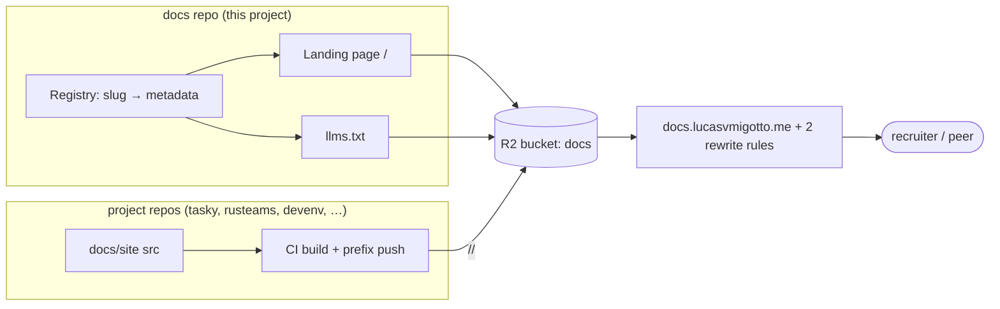

# Product Brief — central docs hub

Status: Draft

## 1. Summary

A single public documentation hub at `docs.lucasvmigotto.me` that lets recruiters and peers reach the docs of every project Lucas builds from one address, instead of remembering a subdomain per project.

One Cloudflare R2 bucket serves a thin landing page at `/` and one path prefix per project (`/tasky/`, `/rusteams/`, `/devenv/`, …). Each project repo keeps its own docs source and publishes its built site to its own prefix; this repo owns only the landing, the registry and the root of the bucket. The hub is deliberately cheap and operator-light: free tiers only, one person, no servers.

## 2. Problem & context

Today each project's documentation lives at its own subdomain (`tasky.lucasvmigotto.me`, `rusteams.lucasvmigotto.me`, `devenv.lucasvmigotto.me`), each with its own deploy workflow and its own Cloudflare rewrite rule. Two problems follow:

- **For readers** (recruiters, peers): there is no single place to browse what Lucas has built. A recruiter who receives one link cannot discover the rest; each project is an island with a separate address to remember or be given.
- **For the operator** (Lucas): the per-subdomain model does not scale on the free plan — Cloudflare allows 10 rewrite rules, so the eleventh project has nowhere to go. Each new project also needs a new hostname, certificate and rule.

The hub replaces N subdomains with one hostname and N path prefixes, which needs only two generic rewrite rules regardless of how many projects exist. It also gives the portfolio a single shareable URL for CVs, LinkedIn and talks.

Alternatives considered: keep per-project subdomains (caps at 10, no discovery), one Cloudflare Worker router in front (more moving parts for the same $0), a bucket per project behind a router (more domains, same storage cost). The chosen design reuses the existing Vite/React docs sources untouched except for their `base` and deploy scope.

## 3. Goals and non-goals

**Goals (measurable)**

- G1 — A visitor at `docs.lucasvmigotto.me` can reach any registered project's docs in one click, and `GET /`, every `GET /<project>/`, and `GET /llms.txt` return 200 with their assets resolving.
- G2 — Adding the Nth project requires **no change to the hub's hosting or rewrite-rule count** (stays at 2 rules), only a new registry row and that project's own publish workflow.
- G3 — The hub runs at **$0/month** on free tiers, operated by one person with no on-call.
- G4 — The hub presents each project in a way a recruiter can scan (name, description, tech tags, live docs link, source link).

**Non-goals** (a reasonable person might assume these are in scope)

- Hosting or rendering the *content* of each project's documentation. The hub links out; each project keeps its own `docs/site/` build. (This is the boundary the architecture is built around.)
- Authentication, user accounts, comments or any write path for visitors.
- A database, search backend or queue — object storage only.
- Per-project `llms.txt` or raw-Markdown page serving (v1 is a hub-level index only).
- Redirecting or deleting the legacy per-project subdomains — Lucas handles that separately.
- Supporting more than English and Portuguese (pt-BR) in v1.
- An uptime SLA; availability is best-effort.

## 4. Audiences

| Audience | Role | Goals | Context & frequency | Expertise |
|---|---|---|---|---|
| **Recruiters** | Primary reader | Quickly judge what Lucas has built and whether to reach out; open live links | Clicked from a CV/LinkedIn post, often on mobile, short attention, occasional | Non-technical to semi-technical |
| **Peers / developers** | Primary reader | Learn how a project works, read its docs, inspect its source | Arrived from a repo, a talk or a shared link; occasional | High |
| **Lucas** | Operator/admin | Publish a project's docs under the hub; add new projects without touching hub hosting | On each project release; ~5 deploys/day across projects | High |
| **Project CI** | Machine actor | Push a project's built docs to its own prefix on `main` | Every push to a project's `main` | N/A |

## 5. Jobs-to-be-done

- **Recruiter** — *When I'm evaluating Lucas for a role, I want to see every project he's built and open its docs, so I can assess his skills and decide whether to make contact.*
- **Peer** — *When I'm curious how one of Lucas's projects works, I want to read its docs and jump to its source, so I can learn from it or use it.*
- **Lucas (operator)** — *When I start a new project, I want its docs to appear under the hub with no change to the hub's hosting or rules, so I can scale to any number of projects without babysitting infrastructure.*
- **Project CI** — *When a project's docs change on `main`, I want them deployed to that project's prefix only, so the hub shows the latest version and no other project is touched.*

## 6. Capabilities & scope

Grouped by area; **MVP** is the smallest set that delivers G1–G4 end to end.

**Landing page**
- MVP — Root landing listing every registered project as a card: name, description, live docs link, source-repo link, tech tags. *(Tags and source links per user decision 2026-10-03; today's card is name + description + docs link only.)*
- MVP — English and Portuguese (pt-BR), with a language switch; the reader's locale is the default where detectable.
- Later — Recruiter-facing header with a CV/contact/portfolio link.
- Later — Generated Open Graph preview image per share (`index.html` currently carries a TODO for this).

**Registry**
- MVP — A static registry in the landing source (`docs/site/src/apps.ts`) mapping `slug → name, description, tech tags, source URL`. The slug is the R2 prefix.
- Later — A registry that is not a code change (CMS or generated from the project repos).

**LLM index**
- MVP — A hub-level `/llms.txt` listing each registered project, its description and its docs URL, generated from the registry so it cannot drift.
- Later — Per-project `llms.txt` and raw-Markdown page serving.

**Deploy & delivery**
- MVP — Root-only deploy from this repo: landing `index.html`, `assets/`, `favicon.svg`, `robots.txt`, `sitemap.xml`, `llms.txt`; never a root `--delete` (ADR 0001).
- MVP — Each project repo deploys to its own `/<slug>/` prefix with prefix-scoped `--delete` (exists in the project repos; verified here by a fitness check).
- MVP — CI guard that fails if a project workflow syncs the bucket root without a prefix or with `--delete` at root.

**Infrastructure**
- MVP — One R2 bucket, Cloudflare Custom Domain `docs.lucasvmigotto.me`, two Transform Rewrite rules for directory-index fallback (ADR 0002). Bucket/domain exist; wiring the deploy and rules is the remaining work.
- MVP — R2 S3 credentials as GitHub secrets per repo.

**Observability**
- MVP — Cloudflare analytics for traffic; a nightly scheduled check that asserts `GET /`, `GET /<slug>/` for every registered project, and `GET /llms.txt` all return 200 **and** that the landing's hashed JS/CSS resolve.
- Later — Per-project health surfaced on the landing cards.

## 7. Key journeys

**J1 — Recruiter reaches a project's docs (MVP).**
A recruiter opens `docs.lucasvmigotto.me` from a CV link on a phone. The landing loads fast and shows project cards with names, one-line descriptions and tech tags. They tap *tasky → Open docs*. Rule 1 rewrites `/tasky` to `/tasky/index.html`; the tasky docs render. They can also tap the source link to see the code. *If a project's prefix is missing* (its repo hasn't published), its card should not silently lead to a 404: the nightly check flags it, and the landing marks the project as not yet published.

**J2 — Peer reads docs then source (MVP).**
A peer follows a shared link, lands on the hub, opens a project's docs, reads a page, then uses the card's source link to jump to the repository. Assets and Markdown under `/<slug>/` pass through the rewrite rules untouched.

**J3 — Lucas publishes a new project (MVP).**
Lucas finishes `docs/site/` in a new project repo, sets its Vite `base` to `/<slug>/` and its deploy to `s3://$BUCKET/<slug>/`, adds one row to `apps.ts`, and pushes the hub. The hub rebuilds; the new card appears; no rewrite rule or bucket setting changes. The nightly check starts asserting the new prefix.

**J4 — An app's docs change (MVP).**
A push to `tasky/main` triggers that repo's workflow, which builds and syncs only `/tasky/`. Other prefixes and the root are untouched. If the deploy fails, the previous version keeps serving; the hub is unaffected.

**J5 — A project's prefix is down (MVP).**
The nightly check finds `GET /<slug>/` != 200, fails, and notifies. The hub itself still serves; only the affected card is degraded.

## 8. Domain overview

**Core concepts.** A **Hub** is this site. A **Project** is one documented codebase. A **Registry entry** binds a project's **slug** to its display metadata and source URL. A **Prefix** is the R2 path `/<slug>/` that only that project's CI writes. The **Landing** is the root document that lists registry entries. **Rewrite rules** map bare and trailing-slash paths to `index.html`. The **LLM index** (`llms.txt`) is the machine-readable list of projects.

**Lifecycle of a Project:** *Registered* (row added to the registry) → *Publishing* (its repo deploys to its prefix) → *Live* (nightly check passes) → *Retired* (row removed; its prefix cleaned up separately). The hub only ever knows Registered and (via the check) Live.

## 9. Glossary

- **Hub** — the public site at `docs.lucasvmigotto.me` that lists and links every project's docs. *Not: portal, index site, docs aggregator.*
- **Project** — one documented codebase published under the hub (e.g. tasky). *Not: app, site, microsite.* The code identifier is `slug`; legacy code names (`apps.ts`, `DocApp`, `APPS`) use "app" and should converge to "project" when next touched.
- **Slug** — the short, stable, lowercase identifier of a project; also its R2 prefix name (e.g. `tasky`). *Not: id, key, name.*
- **Prefix** — the R2 path segment `/<slug>/` owned exclusively by one project's CI. *Not: folder, directory, path.*
- **Landing** — the root document at `/` that renders the registry. *Not: homepage, front page, index.*
- **Registry** — the static list of projects and their metadata in the landing source. *Not: catalog, database, config.*
- **Registry entry** — one row in the registry: slug plus name, description, tech tags and source URL. *Not: record, item.*
- **Tech tag** — a short label naming a technology a project uses, shown on its card (e.g. `Rust`, `React`, `Docker`). *Not: keyword, badge, chip.*
- **LLM index** — the hub-level `llms.txt` enumerating registered projects for machine readers. *Not: AI sitemap, manifest.*
- **Rewrite rule** — a Cloudflare Transform Rewrite that maps a request path to `index.html`; two cover all projects. *Not: redirect, route, fallback.*
- **Prefix push** — a project's CI syncing its built docs to its own prefix. *Not: upload, deploy job.*

## 10. Business rules

- **R1** — The hub root (`/` and root files) is written only by this repo's CI; each project writes only its own `/<slug>/` prefix. *Source: architecture ADR 0001.*
- **R2** — No workflow may run `sync --delete` against the bucket root. *Source: ADR 0001 (root delete wipes all prefixes).*
- **R3** — The landing build must not emit any `/<slug>/` prefix directory. *Source: `docs-hub-ci.yml` assert step.*
- **R4** — A project's slug equals its R2 prefix and its `vite.config.ts` `base` (`/<slug>/`), and its router uses `basename: '/<slug>'`. *Source: ADR 0004.*
- **R5** — Directory-index fallback is provided by exactly two rewrite rules and must not grow with the number of projects. *Source: ADR 0002.*
- **R6** — Every registered project's `/<slug>/` must return 200 in the nightly check; a failing project is surfaced, not silently listed. *Source: user success criterion 2026-10-03.*
- **R7** — Every domain noun in user-facing copy, docs and code uses the glossary term. *Source: pipeline.md.*
- **R8** — All content is public; nothing personal or regulated is published. *Source: [ASSUMPTION: public portfolio only].*

## 11. Non-functional requirements

- **Performance** — Landing Largest Contentful Paint ≤ 2.5 s on a mid-range phone over 4G; initial JS+CSS ≤ 250 KB gzipped (to confirm at build). Hashed assets cached `max-age=31536000, immutable`; `index.html`, `llms.txt`, `robots.txt`, `sitemap.xml` served `no-cache` (html) or `max-age=86400`.
- **Availability** — Best-effort ~99%; single region, no SLA, no multi-region. R2 + Cloudflare CDN. RPO = last `main` push; RTO = re-deploy in minutes from git.
- **Scalability** — Baseline 50 DAU, ~5 pages/visit, ~10 requests/page ≈ **0.03 RPS average**, **~0.6 RPS peak** (link shared), all reads; ~5 writes/day (deploys). Storage ~2–5 MB per project × 10 ≈ **50 MB** (R2 free allowance 10 GB). Target headroom: **10×** (500 DAU ≈ 6 RPS) with no design change.
- **Security** — Public read-only; no auth. R2 S3 keys live in GitHub secrets per repo; the same key is reused across project repos in v1 (accepted risk). Least-privilege bucket scope; keys rotated manually.
- **Privacy & compliance** — **LGPD/GDPR: N/A** — the hub publishes public project documentation, collects no personal data, sets no tracking cookies, and uses only Cloudflare's aggregate analytics. No payment (PCI N/A), no health data (HIPAA N/A).
- **Accessibility** — **WCAG 2.2 AA** on the landing: semantic landmarks, keyboard-operable language switch and links, visible focus, ≥4.5:1 contrast, respects `prefers-reduced-motion`.
- **Localization** — **English (en)** and **Portuguese (pt-BR)**; locale switch on the landing; `lang` attribute set correctly; dates in UTC or locale-formatted; no currency.
- **Observability** — Cloudflare analytics (traffic, cache hit ratio) plus the nightly HTTP check with CI notification on failure.
- **Supported platforms** — Evergreen Chrome, Firefox, Safari, Edge; responsive from 360 px up; no IE, no offline requirement.
- **Maintainability** — Adding a project is a one-row registry change; no hub hosting or rule change.

## 12. Integrations & external systems

| System | Direction | Protocol | Owner | Criticality | If it's down |
|---|---|---|---|---|---|
| Cloudflare R2 (object storage) | out (write), in (read) | S3 API / HTTPS | Cloudflare | Critical | Deploys fail; the site keeps serving the last deployed objects from cache/origin as long as R2 is reachable for reads |
| Cloudflare CDN + Custom Domain + Transform Rules | in (serve) | HTTPS | Cloudflare | Critical | Hub unreachable; no fallback |
| GitHub Actions (this repo + project repos) | trigger | Git / HTTPS | GitHub | High | Deploys are delayed until GitHub recovers; last version keeps serving |
| Project repos (tasky, rusteams, devenv, …) | in (content) | Git | Lucas | High per project | That project's prefix goes stale; the rest of the hub is unaffected |
| Cloudflare analytics | out (read) | HTTPS | Cloudflare | Low | Metrics unavailable; no user impact |

No inbound third-party API calls are made at runtime; the landing is fully static.

## 13. Constraints

- **Budget:** $0/month — free tiers only (Cloudflare R2 free allowance, free plan's 10 rewrite rules, GitHub Actions free minutes).
- **Team:** one person (Lucas), no on-call; must be operable without servers or a build queue.
- **Hosting:** Cloudflare R2 + Custom Domain; no compute/Workers unless the design later demands it.
- **Stack (existing, reuse):** Vite 8 + React 19 + TypeScript + Tailwind 4 + Biome + Bun for the landing; Cloudflare R2 S3 API via `aws s3` in GitHub Actions.
- **Existing systems to reuse:** the three project `docs/site/` builds and their Vite/React stack; ADRs 0001–0004.
- **Deadline:** none — best-effort; no external commitment.
- **Localization:** en + pt-BR only.

## 14. Success metrics

- **Leading**
  - Nightly check: `GET /`, `GET /<slug>/` for every registered project, and `GET /llms.txt` return **200**, and the landing's hashed JS/CSS resolve — target **all green, daily**.
  - Rewrite-rule count stays **2** after adding a project — target: no growth.
  - Landing build (lint, typecheck, build) green on `main` — target: every push.
- **Lagging**
  - Hub is live and publicly reachable — target: achieved once, then continuously 200.
  - Reader traffic to project docs (Cloudflare analytics requests for `/<slug>/`) — target: baseline + trend upward after a CV/LinkedIn link.
  - Zero incidents of a root `--delete` wiping prefixes — target: 0, ever.

## 15. Architecture drivers

Stated as facts for `project:architecture` to decide from; the architecture itself lives in `architecture.md`.

- **Ranked quality attributes:** 1) cost = $0, 2) operability by one person / no on-call, 3) time-to-market (reuse existing sources), 4) availability best-effort ~99%, 5) latency "CDN-fast" (no p95 target).
- **Usage volumes:** ~50 DAU baseline, ~0.03 RPS average, ~0.6 RPS peak, all reads; ~5 deploy writes/day; growth target 10× (500 DAU ≈ 6 RPS); ~50 MB stored for 10 projects.
- **SLOs:** availability ~99% best-effort, no latency SLO beyond CDN, RPO = last `main` push, RTO = minutes.
- **Data residency:** none mandated — `[ASSUMPTION: public docs, no residency requirement]`.
- **Regulated data:** none (no PII, payment or health data).
- **Existing resources:** Cloudflare account with R2 free tier; GitHub org/repos; the three project docs builds.
- **Team & skills:** one senior engineer; comfortable with Vite/React, GitHub Actions, Cloudflare R2.
- **Budget:** $0.
- **Non-driver:** SEO beyond correct canonical/OG tags; the hub is shared by link, not found by search.

## 16. Candidate feature map

Independently shippable, in dependency order. `project:spec` turns these into `specs/NNN-*`.

| # | Feature | Scope (one line) | Priority | Depends on |
|---|---|---|---|---|
| 001 | `hub-landing` | Landing with registry, project cards (name, description, tech tags, docs + source links), en + pt-BR | MVP | — |
| 002 | `llm-index` | Hub-level `llms.txt` generated from the registry at build | MVP | 001 |
| 003 | `hub-deploy` | Wire R2 bucket, custom domain, two rewrite rules, root-only deploy and secrets | MVP | 001 |
| 004 | `health-monitoring` | Nightly 200 + asset checks; CI fitness guards (no root `--delete`, correct `base`/`basename`, no prefix emitted) | MVP | 003 |
| 005 | `og-images` | Generated Open Graph image per share | Later | 001 |
| 006 | `contact-header` | Recruiter-facing CV/contact/portfolio link | Later | 001 |
| 007 | `legacy-redirects` | 301s from old `<project>.lucasvmigotto.me` subdomains | Later (owner: Lucas) | 003 |
| 008 | `dynamic-registry` | Registry not requiring a code change | Later | 001 |

## 17. Risks & assumptions

| Risk | Likelihood | Impact | Mitigation |
|---|---|---|---|
| Reachable but unhelpful — a 200 page with broken assets or an empty card list | Medium | Medium | Nightly check asserts assets resolve; card shows a not-published state |
| Root `--delete` wipes all prefixes | Low | Critical | CI fitness check fails any unscoped/root sync (R2) |
| R2 secret sprawl across N project repos | Medium | Medium | Accepted for N < ~15; central collector as the evolution trigger |
| R2 key leak | Low | High | Rotate keys; least-privilege scope; secrets never in code |
| Registry drifts from actual prefixes | Medium | Medium | Nightly check fails on a missing registered prefix |
| en/pt-BR translation drift | Medium | Low | Single source of copy; glossary; review on change |
| Free-tier limits (10 rewrite rules) | Low | High | Design uses 2 rules, constant in N |

**Assumptions** (collected):
- `[ASSUMPTION: public portfolio only — no personal or regulated data]`
- `[ASSUMPTION: no data-residency mandate]`
- `[ASSUMPTION: free tiers remain sufficient at ~50 DAU and ~50 MB]`
- `[ASSUMPTION: recruiters/peers value a browsable docs hub enough to justify it]`
- `[ASSUMPTION: the project repos can adopt absolute base + basename per ADR 0004]`

## 18. Open questions

- What is the shared R2 **bucket name/ID** to be referenced by every workflow? *(Lucas)*
- Legacy subdomains: **301 to the prefixes or delete**? *(Lucas — handling separately)*
- Is Cloudflare's default aggregate analytics acceptable, or is a privacy-first alternative wanted? *(Lucas)*
- Who provides the **pt-BR copy** for descriptions and UI strings, and is machine translation acceptable as a draft? *(Lucas)*
- Should the landing show a **not-yet-published** state for registered-but-unlive projects, or omit them until live? *(Lucas)*

## 19. Decision log

| Date | Decision | Alternatives | Reason |
|---|---|---|---|
| 2026-10-03 | Adopt the product pipeline (brief → spec → build) | stay bespoke with architecture + ADRs | user wants formal features and tracked status |
| 2026-10-03 | Primary objective: formalize the brief, then ship the hub live | design-only; ship without a brief | user chose to formalize first, then go live |
| 2026-10-03 | Audience is recruiters and peers | internal only | matches portfolio use and OG/share design |
| 2026-10-03 | Success = hub live and 200, extended to asset resolution | reachability only | "200 but broken" does not serve the reader |
| 2026-10-03 | Landing cards add tech tags and a source-repo link | name + description + docs link only | recruiters scan skills; peers want the code |
| 2026-10-03 | Localize the hub to en + pt-BR | English only | user decision |
| 2026-10-03 | LLM index is hub-level `llms.txt` only | per-project + raw Markdown | smallest set that serves machine readers |
| 2026-10-03 | Registry is open-ended; projects added as they publish | fixed list of three | the point of prefixes is unlimited projects |
| 2026-10-03 | Legacy subdomain handling is out of scope | include 301s in MVP | user handles it separately |
| 2026-10-03 | Canonical term is **Project**; code `App` identifiers converge later | keep "app" | user-facing copy and docs already say "project" |

## Coverage

- Every audience (§4) has ≥1 job (§5); every MVP job has a journey (§7). ✅
- Every MVP capability (§6) appears in the feature map (§16). ✅
- Every domain noun used is in the glossary (§9). ✅
- NFRs carry numbers (§11). ✅
- Compliance regime named or N/A with reason (§11). ✅
- Every integration has failure behavior (§12). ✅
- Architecture drivers are numbers or explicit unknowns (§15). ✅
- Assumptions (§17) and open questions (§18) collected. ✅
